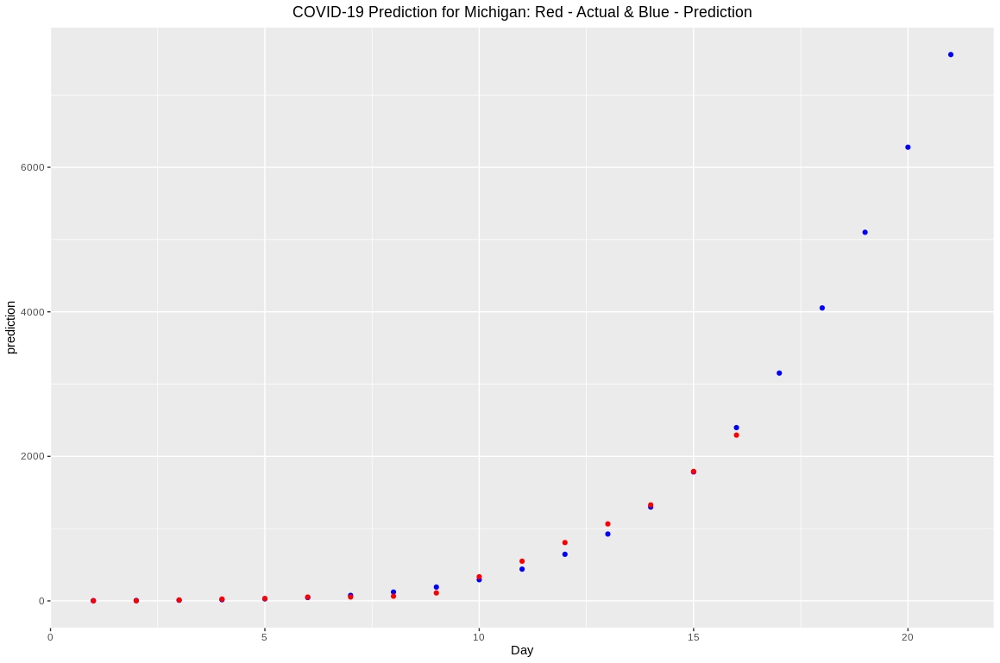

# covid19-Michigan
This repo contains data and script for predicting COVID 19 cases for MI across all counties. The prediction model uses Exponential regression. The summary and metrics of the model are as follows

```

Call:
lm(formula = log(Cases) ~ Day + I(Day^2), data = data[samples, 
    ])

Residuals:
     Min       1Q   Median       3Q      Max 
-0.62949 -0.11913  0.07627  0.18488  0.43085 

Coefficients:
             Estimate Std. Error t value Pr(>|t|)    
(Intercept)  0.421068   0.340882   1.235   0.2480    
Day          0.635627   0.091046   6.981 6.46e-05 ***
I(Day^2)    -0.010972   0.005013  -2.189   0.0564 .  
---
Signif. codes:  0 ‘***’ 0.001 ‘**’ 0.01 ‘*’ 0.05 ‘.’ 0.1 ‘ ’ 1

Residual standard error: 0.3344 on 9 degrees of freedom
Multiple R-squared:  0.9815,	Adjusted R-squared:  0.9774 
F-statistic: 238.4 on 2 and 9 DF,  p-value: 1.603e-08
```
### Predicted data graph
In the below actual vs prediction graph, we can see a good exponential growth curve. 


### Data Source
[1] https://www.clickondetroit.com/news/local/2020/03/20/michigan-covid-19-data-tracking-case-count-cases-by-county-deaths-cases-by-age-tests/

[2] https://www.michigan.gov/coronavirus/
